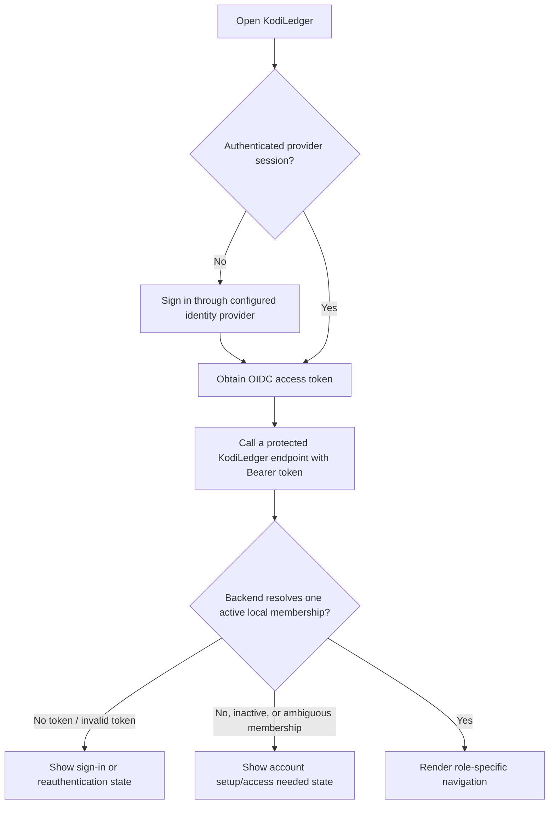
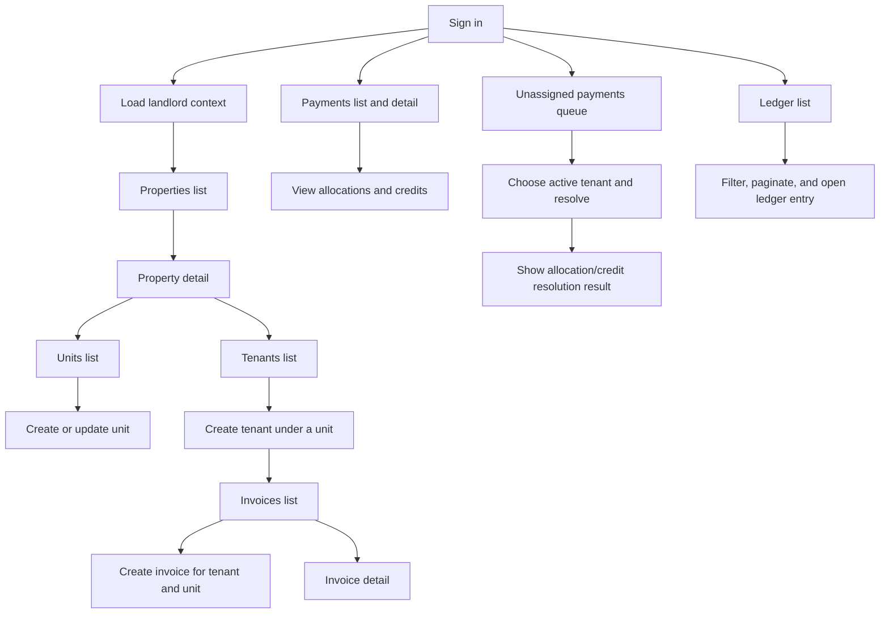
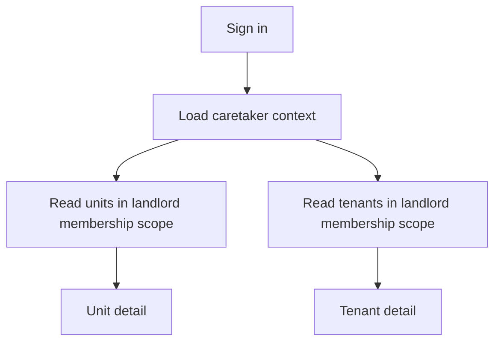
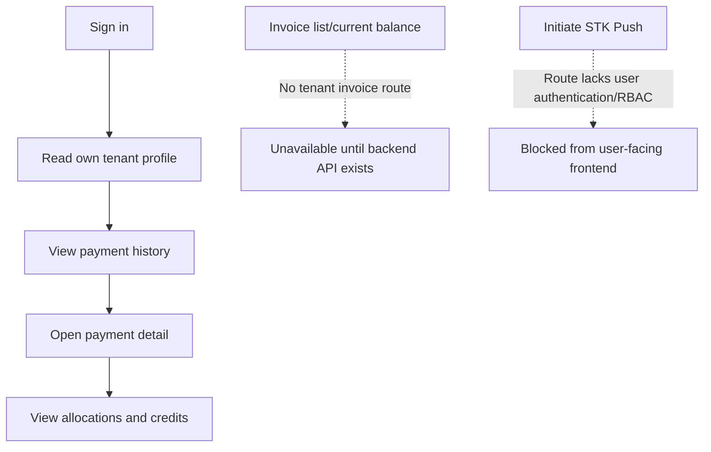
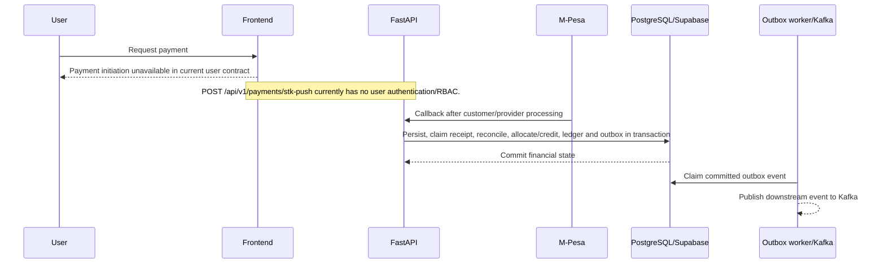

# KodiLedger Application Flows

This document maps the current backend capabilities to the intended user journeys. It is a frontend planning reference, not evidence that a screen or workflow already exists. The repository currently has no frontend application. Endpoint details and response fields are defined in [API.md](API.md); authentication rules are in [auth.md](auth.md).

## 1. Flow status

- **Implemented API flow:** a registered API route supports the operation described.
- **Frontend to build:** the backend operation exists, but no frontend screen is implemented in this repository.
- **Unavailable:** there is no current route for the operation.
- **Blocked:** the route exists but should not be exposed to end users until the stated security or contract issue is resolved.

The frontend must not present unavailable or blocked operations as if they work.

## 2. Application entry and identity

The backend validates the provider token, then resolves its issuer and subject to a local active KodiLedger account and exactly one active membership. The frontend does not select or infer a role from JWT claims. Membership creation, signup provisioning, and switching between multiple memberships are unavailable in the current API.

Use the context endpoint for the signed-in role where appropriate:

- `GET /api/v1/bff/landlord/me` for landlord context and property count.
- `GET /api/v1/bff/caretaker/me` for caretaker context.
- `GET /api/v1/tenants/me` for a tenant's own record.

Authentication failures should be handled by status: 401 means the credential is missing or invalid; 403 means the authenticated identity is not authorized or lacks a valid membership. Do not expose raw token contents in UI, logs, or support instructions.

## 3. Landlord journey

### Landlord screens and API calls

| Screen/journey | API operation | Current capability and constraints |
|---|---|---|
| Home/context | `GET /api/v1/bff/landlord/me` | Returns membership context and property count. There is no dashboard aggregate endpoint. |
| Property list/detail | `GET /api/v1/properties`, `GET /api/v1/properties/{property_id}` | Read-only. Property create, edit, and delete are unavailable. |
| Unit management | `GET /api/v1/properties/{property_id}/units`, `POST /api/v1/properties/{property_id}/units`, `GET /api/v1/units/{unit_id}`, `PATCH /api/v1/units/{unit_id}` | Create/update supported. No delete route; occupancy is read-only and has no tenant lifecycle command. |
| Tenant management | `GET /api/v1/tenants`, `GET /api/v1/tenants/{tenant_id}`, `POST /api/v1/tenants` | Read/create supported. Tenant edit, deactivation, reassignment, and delete are unavailable. |
| Invoice management | `GET /api/v1/invoices`, `GET /api/v1/invoices/{invoice_id}`, `POST /api/v1/invoices` | Read/create supported. Invoice update, mark-paid, cancellation, and delete are unavailable. Server computes total and payment state. |
| Payment history | `GET /api/v1/payments`, `GET /api/v1/payments/{payment_id}` | Read-only history for tenant-linked payments. Unassigned receipts use their separate queue. |
| Payment financial detail | `GET /api/v1/payments/{payment_id}/allocations`, `GET /api/v1/payments/{payment_id}/credits` | Read-only. No generic allocation command or credit mutation route exists. |
| Unassigned payment resolution | `GET /api/v1/unassigned-payments`, `POST /api/v1/unassigned-payments/{payment_id}/resolve` | Landlord chooses an active same-landlord tenant. Request body contains only `tenant_id`; API chooses the unit and uses the existing financial engine. |
| Ledger | `GET /api/v1/ledger`, `GET /api/v1/ledger/{entry_id}` | Read-only, with bounded offset pagination and supported filters on the collection route. |

## 4. Caretaker journey

Current caretaker routes are `GET /api/v1/bff/caretaker/me`, unit reads, and tenant list/detail reads. Caretakers do not currently have invoice, payment, ledger, tenant-write, or unit-write access through the documented API. Do not show those actions as enabled.

## 5. Tenant journey

Current tenant capabilities are:

- `GET /api/v1/tenants/me` for the tenant record resolved from active membership.
- `GET /api/v1/payments` and `GET /api/v1/payments/{payment_id}` for tenant-scoped, tenant-linked payment history.
- Payment-scoped allocation and credit reads for visible payments.

Tenant invoice list/detail, current balance, tenant-directed payment initiation, and payment status polling are not currently available as a complete authenticated tenant flow. The frontend must not infer an invoice balance from only the visible payment history.

## 6. M-Pesa payment lifecycle

The callback is provider-to-backend and is not a browser action. An STK initiation response is not proof of a completed payment. Only the backend callback/reconciliation path establishes confirmed financial state. The end-user frontend should not call the currently unauthenticated STK route until the backend closes that security gap and documents the authenticated request/response lifecycle.

When payment initiation is made available safely, the frontend must distinguish at least “request initiated / awaiting provider result” from “confirmed and reconciled.” It must refresh or poll only through a documented authenticated API; do not treat a return-to-app redirect or local success message as confirmation.

## 7. Unassigned payment resolution journey

1. Landlord opens `GET /api/v1/unassigned-payments` and sees unresolved receipt details returned by the API.
2. Landlord selects an active tenant in the same landlord scope. The UI may use the landlord's tenant list, but the API remains authoritative and revalidates ownership and active status.
3. Frontend sends `POST /api/v1/unassigned-payments/{payment_id}/resolve` with exactly `{"tenant_id":"<UUID>"}`.
4. Backend locks the financial rows, attaches the tenant/unit, and reuses the existing allocator and credit behavior.
5. Backend commits payment assignment, allocation/credit, invoice state, ledger, processing state, and outbox together.
6. Frontend displays the returned resolution result. It must explain that a payment may be resolved without an invoice allocation if there is no unpaid invoice; remaining funds may be held as credit.
7. A repeat or concurrent resolution can return 409. The UI should refresh the queue and show the current state; it must not assume the repeated command replays the first success response.

## 8. Ledger journey

1. Landlord opens `GET /api/v1/ledger`.
2. Frontend sends only supported filters and pagination parameters (`limit`, `offset`, supported resource IDs/receipt, and inclusive time bounds). Landlord scope always comes from the authenticated membership.
3. Frontend renders `items`, `total`, `limit`, and `offset`, ordered by the API's deterministic order.
4. Landlord opens `GET /api/v1/ledger/{entry_id}` for detail.

Ledger is read-only in the public API. Do not offer create, edit, delete, or reverse actions. A ledger row represents the persisted entry; do not reconstruct financial effects from UI calculations.

## 9. Shared UI states

Every API-driven screen should handle:

- **Loading:** request is in progress; prevent duplicate form submissions where appropriate.
- **Empty:** successful response with an empty array/page; offer only actions the current API supports.
- **Validation (422):** show field-level validation details where possible without relying on server exception wording.
- **Unauthenticated (401):** request sign-in/reauthentication.
- **Forbidden (403):** show that the signed-in membership is not allowed to perform the operation.
- **Not found (404):** show unavailable resource without revealing cross-landlord data.
- **Conflict (409):** refresh the resource/queue and explain that the operation is already resolved or conflicts with current state.
- **Unavailable (502/503):** show a retryable service/dependency message without asserting a financial outcome.
- **Unexpected failure (500):** show a generic error and a safe retry path; do not expose stack traces or credentials.

## 10. MVP sequence and dependencies

Suggested frontend build order:

1. Authentication/session shell and membership-required state.
2. Role-specific navigation and landlord/caretaker/tenant context loading.
3. Landlord property and unit read/manage screens.
4. Landlord tenant and invoice read/create screens.
5. Payment history, payment financial detail, and read-only ledger.
6. Unassigned payment queue and resolution with conflict/refresh handling.
7. Tenant self-profile and payment history.

Keep tenant invoicing/payment initiation out of the initial implementation until the missing authenticated backend contracts exist. Do not block frontend scaffolding on a reverse proxy; local browser-to-API development can use explicit API URL and CORS configuration. Production deployment must provide HTTPS and correctly handle trusted proxy headers and M-Pesa source-IP validation if a proxy is introduced.

## 11. Related references

- [Technical requirements](TECHNICAL_REQUIREMENTS.md)
- [API contract](API.md)
- [Authentication and authorization](auth.md)
- [Database schema and migrations](DATABASE.md)
- [Security posture](SECURITY.md)
- [Testing guide](TESTING.md)
