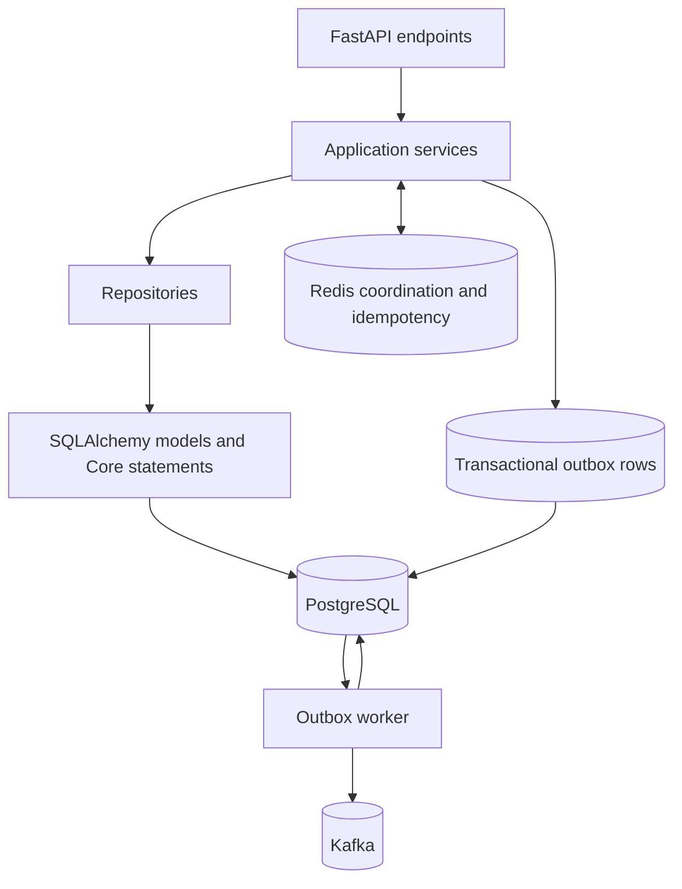
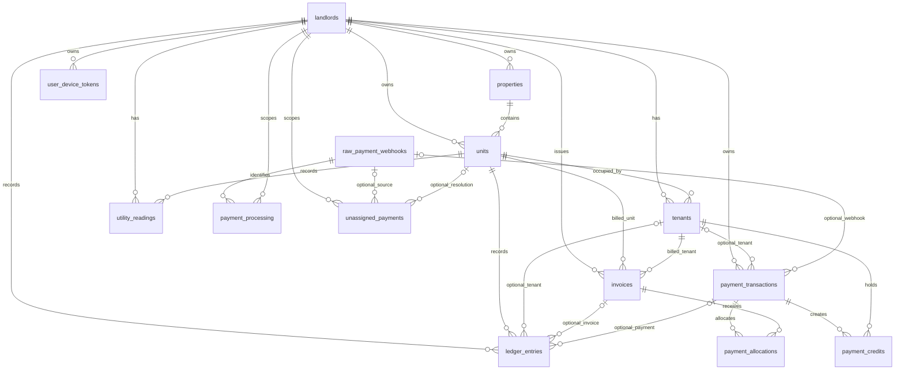

# Database

## 1. Overview

PostgreSQL is KodiLedger's authoritative persistent store. Financial records, webhook processing state, payment allocations and credits, ledger entries, and durable event-publication work are stored in PostgreSQL. Redis supports coordination and fast-path idempotency; it is not the source of truth for financial state.

The application persistence layer uses SQLAlchemy's asynchronous engine and `AsyncSession` APIs. `app/models/base.py` defines the shared declarative base used by the mapped models. PostgreSQL connections use the `asyncpg` driver (`asyncpg` is a project dependency), and connection URLs are supplied through `DATABASE_URL` and `SYSTEM_DATABASE_URL`.

`app/core/database.py` creates two independent async engines and session factories:

- **Application connection:** `engine` and `AsyncSessionLocal`, exposed through `get_db()`. The source comments describe this as the normal `kodiflow_app` connection with row-level security (RLS) enforced.
- **System connection:** `system_engine` and `SystemSessionLocal`, exposed through `get_system_db()`. The webhook endpoint and Outbox worker use this connection for trusted system workflows. `kodiflow_system` has no role-level `BYPASSRLS`; migration `0019_system_role_rls_policies.sql` grants it explicit system-only policies on the RLS-protected tables required by those workflows.

Both engines use `pool_pre_ping=True`, a 300-second pool recycle interval, and `expire_on_commit=False` sessions. Services own transaction boundaries: for example, `WebhookService` commits successful or duplicate webhook work and rolls back on errors. Repositories issue database statements but do not commit or roll back. This lets payment processing and its associated financial writes participate in the service's transaction.

## 2. Database Architecture

FastAPI endpoints receive an `AsyncSession` and delegate workflow decisions to application services. Services call repositories, which use SQLAlchemy Core or ORM statements against mapped models and PostgreSQL. The RLS dependency sets transaction-local `app.current_landlord_id`, `app.current_user_id`, and `app.current_role` values for authenticated application requests.

Webhook processing uses the system database connection. Redis provides a fast coordination/idempotency layer, while PostgreSQL's receipt uniqueness constraint is authoritative. Durable asynchronous events are recorded in `outbox_events` in PostgreSQL. A separate worker claims outbox rows, publishes them to Kafka, and records publication, retry, or terminal-failure state in PostgreSQL.



For webhook payments, the service commits the processing and financial work after reconciliation. Outbox rows are persisted in PostgreSQL and claimed with row locking and `SKIP LOCKED`; the worker commits the claim before publishing, then separately records the result. Failed publications are rescheduled or marked failed according to the worker's retry policy. This keeps Kafka availability outside the critical financial transaction while preserving durable publication intent.

## 3. Database Connections

Connection values come from application settings and the `.env` configuration mechanism. This document names the settings but does not publish their values.

| Setting or object | Configuration and purpose |
| --- | --- |
| `DATABASE_URL` | Required setting used to create the normal application `engine`. It is the connection used by `get_db()` and the application session factory. The database module comments identify this path with RLS enforcement and the `kodiflow_app` role. |
| `SYSTEM_DATABASE_URL` | Required setting used to create the privileged `system_engine`. It is used by `get_system_db()` for webhook and system workflows. Its value is separate from `DATABASE_URL`; credentials must be configured outside source documentation. |
| `engine` | Async SQLAlchemy engine built from `DATABASE_URL` by `_create_engine()`. |
| `system_engine` | Separate async SQLAlchemy engine built from `SYSTEM_DATABASE_URL` with the same engine options. |
| `AsyncSessionLocal` | `async_sessionmaker` bound to `engine`, configured for `AsyncSession` and `expire_on_commit=False`. |
| `SystemSessionLocal` | `async_sessionmaker` bound to `system_engine`, configured for `AsyncSession` and `expire_on_commit=False`. |
| `get_db()` | Async FastAPI dependency that opens an `AsyncSessionLocal` session and yields it to the request. |
| `get_system_db()` | Async FastAPI dependency that opens a `SystemSessionLocal` session and yields it to the request. |

`_create_engine()` disables SQL echo, enables `pool_pre_ping`, and sets `pool_recycle=300`. The system connection exists because selected workflows need access beyond the normal landlord-scoped application privileges. Migration `0011_rls_role_hardening.sql` creates `kodiflow_system` without `BYPASSRLS`, grants it table privileges, revokes `kodiflow_app` access to `raw_payment_webhooks` and `outbox_events`, and grants the system role access to those tables. Migration `0019_system_role_rls_policies.sql` adds explicit system-only policies on the RLS-protected tables required by trusted callbacks and workers. These policies allow the system role to access all rows on the named tables, but do not bypass RLS on other or future tables. The system role remains high-trust and its credential must be kept separate from normal user-facing application requests. No password or real environment value is documented here.

At FastAPI startup, the lifespan handler executes `SELECT 1` through both configured engines. Startup fails with a sanitized error if either database connection cannot be established; shutdown disposes both engine pools. Pointing the two URL settings at Supabase therefore validates both the ordinary RLS role and the trusted system role without creating a second synchronous database connection in `main.py`.

## 4. Schema Overview

The following inventory is checked against all SQL files in `db/migrations/`. The 15 migration-backed tables are: `landlords`, `properties`, `units`, `tenants`, `utility_readings`, `invoices`, `raw_payment_webhooks`, `ledger_entries`, `unassigned_payments`, `user_device_tokens`, `payment_processing`, `payment_transactions`, `payment_allocations`, `payment_credits`, and `outbox_events`. Primary keys are UUIDs with `gen_random_uuid()` defaults unless noted otherwise. “No action” below means the migration omitted an `ON DELETE` action, so PostgreSQL's default applies.

### Core property and tenancy tables

| Table | Purpose; primary key and important columns | Foreign keys and constraints | Indexes / state |
| --- | --- | --- | --- |
| `landlords` | Landlord account. PK `id`; `full_name`, unique `email`, unique `phone_number`, optional `kra_pin` and `business_shortcode`, `created_at`, `updated_at`. | No foreign keys. Email and phone are unique and required. | No explicit secondary indexes in migration `0001`. |
| `properties` | Rental property. PK `id`; `landlord_id`, `name`, `county`, optional `town_location`, `total_units`, `created_at`. | `landlord_id` → `landlords.id` (`CASCADE`); `total_units > 0`. | `idx_properties_landlord`. |
| `units` | Rentable unit. PK `id`; `property_id`, `landlord_id`, `unit_number`, `base_rent`, `garbage_fee`, `security_fee`, `water_rate_per_unit`, `is_occupied`, `created_at`. | Property and landlord FKs both `CASCADE`; unique `(property_id, unit_number)`; `base_rent >= 0`, `garbage_fee >= 0`, and `security_fee >= 0`. | `idx_units_landlord`, `idx_units_property`; `is_occupied` is a boolean state, default false. |
| `tenants` | Tenant and lease details. PK `id`; `landlord_id`, `unit_id`, `full_name`, `primary_phone`, optional `id_number`, `lease_start_date`, `deposit_amount`, `is_active`, `created_at`. | Landlord FK `CASCADE`; unit FK `RESTRICT`. | `idx_tenants_landlord`, `idx_tenants_phone`; `is_active` defaults true. |
| `utility_readings` | Water reading for a unit. PK `id`; landlord/unit IDs, `reading_month`, previous/current readings, generated `consumption`, `total_water_cost`, `recorded_by_user_id`, `created_at`. | Landlord and unit FKs both `CASCADE`; check `current_reading >= previous_reading`. `recorded_by_user_id` is not a foreign key in migration `0001`. | No explicit secondary index in migration `0001`. |
| `invoices` | Monthly charge record. PK `id`; landlord/unit/tenant IDs, unique `invoice_number`, `billing_month`, rent/water/garbage/security amounts, generated `total_amount`, `due_date`, `is_paid`, `created_at`. | Landlord FK `CASCADE`; unit and tenant FKs `RESTRICT`. | `idx_invoices_landlord`, `idx_invoices_tenant`; `is_paid` defaults false. Migration `0008` adds `idx_invoices_tenant_unpaid_order` on `(tenant_id, is_paid, billing_month, created_at)`. |

### Payment and accounting tables

| Table | Purpose; primary key and important columns | Foreign keys and constraints | Indexes / state |
| --- | --- | --- | --- |
| `raw_payment_webhooks` | Raw callback audit record. PK `id`; optional `source_provider`, merchant/check-out IDs and receipt, required JSONB `raw_payload`, `processed`, `error_log`, `created_at`. | No foreign keys are declared on this table. | `idx_raw_webhooks_receipt`; `processed` defaults false. |
| `payment_processing` | Receipt-level processing/idempotency state. PK `id`; unique `mpesa_receipt_number`, `raw_webhook_id`, `landlord_id`, `status`, `created_at`, and nullable `processed_at` (added in `0003`). | Raw webhook FK `RESTRICT`; landlord FK `CASCADE`; status check allows `PROCESSING`, `COMPLETED`, `FAILED`, `UNASSIGNED`. | `idx_payment_processing_landlord`, `idx_payment_processing_webhook`, `idx_payment_processing_receipt`; status is the processing state. |
| `payment_transactions` | Normalized payment identity and callback/payment data. PK `id`; landlord ID, optional tenant/raw-webhook IDs, optional merchant/check-out IDs, unique required receipt, optional payer phone/name, amount, payment method, status, `created_at`, optional `completed_at`. | Landlord FK `RESTRICT`; tenant and raw-webhook FKs `SET NULL`; amount check `amount > 0`; payment method uses `payment_method_enum`; status uses `payment_transaction_status_enum`. | `idx_payment_transactions_landlord`, `_tenant`, `_receipt`, `_raw_webhook`, `_merchant_request`, `_checkout_request`; state defaults to `PENDING`. |
| `payment_allocations` | Amount of a payment applied to an invoice. PK `id`; payment transaction ID, invoice ID, amount, status, `created_at`, optional `reversed_at`. | Transaction and invoice FKs both `RESTRICT`; amount check `amount > 0`; unique `(payment_transaction_id, invoice_id)`; status uses `payment_allocation_status_enum` (`ALLOCATED`, `REVERSED`). | `idx_payment_allocations_payment`, `_invoice`, `_status`; `0008` also adds `idx_payment_allocations_invoice_status` on `(invoice_id, status)`. |
| `payment_credits` | Credit state associated with a payment transaction and tenant. PK `id`; payment transaction ID, tenant ID, amount, status, `created_at`, optional `applied_at`. | Both FKs `RESTRICT`; amount must be positive; status is limited to `AVAILABLE`, `APPLIED`, `REFUNDED`, or `CANCELLED`. | `idx_payment_credits_tenant`, `_payment_transaction`, `_status`; status defaults to `AVAILABLE`. |
| `payment_credit_applications` | Immutable credit amount applied to an invoice. PK `id`; payment credit ID, invoice ID, amount, application key, `created_at`. | Both FKs `RESTRICT`; amount must be positive; unique application key and unique credit/invoice pair; RLS enforces same tenant and landlord. Application-role grants allow SELECT/INSERT only. | Invoice and payment-credit indexes; created by migration `0017`. |
| `ledger_entries` | Financial ledger record. PK `id`; landlord/unit IDs, optional tenant/invoice IDs, optional receipt and merchant ID, entry type, amount, payment method, status, payer fields, account reference, description, `created_at`. Migration `0006` adds nullable `payment_transaction_id`. | Landlord FK `CASCADE`; unit FK `RESTRICT`; tenant FK `RESTRICT`; invoice FK `SET NULL`; payment transaction FK `RESTRICT` (added in `0006`). Amount must be positive. Entry type uses `ledger_entry_type_enum`; status uses `payment_status_enum`; payment method uses `payment_method_enum`. | `idx_ledger_landlord`, `_unit`, `_tenant`, `_receipt`, and `idx_ledger_payment_transaction` (added in `0006`); status defaults to `INITIATED`. |
| `unassigned_payments` | Persists an unmatched payment for later resolution. PK `id`; landlord ID, optional raw webhook ID, unique receipt, amount, payer phone/name, invalid account reference, `is_resolved`, optional resolved unit/user IDs, `resolved_at`, `created_at`. | Landlord FK `CASCADE`; raw-webhook and resolved-unit FKs use PostgreSQL default delete behavior; `resolved_by_user_id` has no FK in `0001`. | `idx_unassigned_landlord`; `is_resolved` defaults false. |

### System and event tables

| Table | Purpose; primary key and important columns | Foreign keys and constraints | Indexes / state |
| --- | --- | --- | --- |
| `user_device_tokens` | Push-notification device token. PK `id`; landlord ID, unique required `device_token`, required `platform`, `last_used_at`. | Landlord FK `CASCADE`. | `idx_device_tokens_landlord`. |
| `outbox_events` | Durable event-publishing work. PK `id`; event/aggregate type and aggregate UUID, unique `idempotency_key`, JSONB payload, status, attempts, `available_at`, `published_at`, `last_error`, `created_at`, nullable `locked_at` (added in `0012`). | `aggregate_id` is not a foreign key; no other FKs. Status check allows `PENDING`, `PUBLISHED`, `FAILED`; attempts must be nonnegative. | `idx_outbox_events_pending`, `idx_outbox_events_aggregate`, `idx_outbox_events_created_at`; `0012` adds partial `idx_outbox_events_claimable` for pending status. Status and attempts track publication state and retries. |

`0001_initial_schema.sql` also creates the `tenant_balances_view`; it is a view, not a table. The migrations define `payment_status_enum`, `payment_method_enum`, `ledger_entry_type_enum`, `payment_transaction_status_enum`, and `payment_allocation_status_enum`.

## 5. Entity Relationships

The diagram shows foreign-key relationships declared by migrations. It does not imply ORM navigation where model relationships are incomplete. Arrows denote one parent row to zero or more child rows. Delete behavior is given in the table inventory above. `payment_processing` and `payment_transactions` each have a unique receipt column, but there is **no foreign key between those two tables**.



All diagram edges correspond to migration foreign keys. There is no landlord foreign key on `raw_payment_webhooks`. `outbox_events.aggregate_id` is an application-level aggregate identifier with no foreign key.

## 6. Financial Data Model

The application workflow can be summarized as:

```text
M-Pesa callback
  → raw_payment_webhooks
  → payment_processing
  → payment_transactions
  → payment_allocations and/or payment_credits
  → ledger_entries
```

This is a persistence/workflow summary, not a chain of foreign keys or a claim that every payment produces every row. The callback is first retained in `raw_payment_webhooks`. `payment_processing` stores receipt-level processing state and links to its raw webhook. A normalized `payment_transactions` row stores the payment identity and has its own optional link to the raw webhook. The processing row and transaction row are associated by receipt value at the application level; there is no direct FK between them.

`payment_allocations` records amounts assigned to invoices. `payment_credits` records a payment-related credit associated with a tenant. `ledger_entries` stores debit/credit accounting entries; migration `0006` adds its optional payment-transaction link. The migrations do not make an allocation or credit automatically create a ledger entry; that orchestration belongs to application services.

If a successful payment cannot be matched to an invoice/account, `unassigned_payments` stores the receipt, amount, payer information, invalid account reference, and resolution fields. `is_resolved`, `resolved_unit_id`, `resolved_by_user_id`, and `resolved_at` represent its unresolved/resolved state. It optionally references the raw webhook; it does not reference `payment_processing` or `payment_transactions` by foreign key.

| Persistence role | Table |
| --- | --- |
| Raw external input | `raw_payment_webhooks` |
| Receipt processing state and idempotency key | `payment_processing` (`mpesa_receipt_number` is unique) |
| Normalized payment identity | `payment_transactions` (`mpesa_receipt_number` is independently unique) |
| Invoice allocation | `payment_allocations` |
| Tenant payment credit | `payment_credits` |
| Financial ledger state | `ledger_entries` |
| Unresolved/unassigned payment state | `unassigned_payments` |

## 7. Payment Processing

`payment_processing` is a receipt-level idempotency and processing-state table for webhook handling. Its exact migration-backed fields are `id`, `mpesa_receipt_number`, `raw_webhook_id`, `landlord_id`, `status`, `created_at`, and `processed_at`. The first six except `processed_at` are created by `0002_payment_processing.sql`; `processed_at` is added as nullable `TIMESTAMPTZ` by `0003_add_payment_processing_processed_at.sql` and is mapped as a nullable timezone-aware timestamp in `PaymentProcessing`.

`mpesa_receipt_number` is `VARCHAR(100) NOT NULL UNIQUE`, making it the database idempotency constraint for a receipt. `status` is `VARCHAR(20) NOT NULL` and constrained to `PROCESSING`, `COMPLETED`, `FAILED`, or `UNASSIGNED`. `raw_webhook_id` references `raw_payment_webhooks.id` with `ON DELETE RESTRICT`; `landlord_id` references `landlords.id` with `ON DELETE CASCADE`. The migration creates `idx_payment_processing_landlord`, `idx_payment_processing_webhook`, and `idx_payment_processing_receipt` (the receipt also has a unique constraint).

There are no attempt count, retry delay, merchant-request ID, or check-out-request ID columns on this table. Those request identifiers exist on `raw_payment_webhooks` and `payment_transactions`. Its timestamps are `created_at` and nullable `processed_at`. Its mapped relationships are named `raw_webhook` and `landlord`; the intended target columns are the two foreign keys above. Some counterpart `back_populates` declarations are not mapped on their counterpart classes in the current model files, so the database foreign keys are the reliable relationship definition.

## 8. Payment Transactions

`payment_transactions` stores normalized payment identity and payment details, separately from receipt-processing state. Migration `0004_payment_transactions.sql` defines:

- `id` UUID primary key; `landlord_id` required; nullable `tenant_id` and `raw_webhook_id`.
- Nullable `merchant_request_id` and `checkout_request_id`; required unique `mpesa_receipt_number`.
- Nullable `payer_phone` and `payer_name`; required `amount NUMERIC(12,2)` and `payment_method`.
- `status`, required `created_at`, and nullable `completed_at`.

The landlord FK uses `ON DELETE RESTRICT`; tenant and raw-webhook FKs use `ON DELETE SET NULL`. `amount` must be greater than zero. `payment_method` uses `payment_method_enum`; `status` uses `payment_transaction_status_enum` with `PENDING`, `COMPLETED`, `FAILED`, `CANCELLED`, and `REVERSED`, defaulting to `PENDING`. The migration creates indexes for landlord, tenant, receipt, raw webhook, merchant request, and check-out request.

The current `PaymentTransaction` model maps the fields and status/payment-method enums, but it does not map all migration metadata identically: it does not declare the named receipt index separately from the unique receipt constraint, and its timestamp fields rely on inferred SQLAlchemy `DateTime` types without `timezone=True`, while the migration uses `TIMESTAMPTZ`. Migration `0006` also adds `ledger_entries.payment_transaction_id`; the current `LedgerEntry` model does not map that column.

## 9. Migrations and Row-Level Security

The migration sequence currently present in `db/migrations/` is:

1. `0001_initial_schema.sql` creates the core rental, utility, invoice, webhook, ledger, unassigned-payment, and device-token schema; enums, indexes, selected initial RLS policies, and `tenant_balances_view` are also defined.
2. `0002_payment_processing.sql` adds receipt processing state; `0003_add_payment_processing_processed_at.sql` adds its completion timestamp.
3. `0004_payment_transactions.sql`, `0005_payment_allocations.sql`, and `0007_payment_credits.sql` add normalized payment records, invoice allocations, and payment credits. `0006_link_ledger_to_payment_transaction.sql` adds the ledger-to-payment-transaction FK. `0008_add_financial_query_indexes.sql` adds invoice and allocation query indexes.
4. `0009_outbox_events.sql` creates the outbox. `0012_outbox_claiming.sql` adds the lock timestamp and pending-claim index.
5. `0010_row_level_security.sql` adds the `app` security-context functions, enables and forces RLS on tenant/financial tables, and defines scoped policies. `0011_rls_role_hardening.sql` replaces the earlier role-based policies and defines the privileged `kodiflow_system` role and grants.

`app/security/rls.py` sets `app.current_landlord_id`, `app.current_user_id`, and `app.current_role` with transaction-local `set_config(..., true)`. Migration `0010` enables and forces RLS on landlords, properties, units, tenants, invoices, ledger entries, payment processing, payment transactions, allocations, credits, unassigned payments, utility readings, and device tokens. Migration `0011` scopes normal row access to the current landlord and applies stricter write/delete rules. `raw_payment_webhooks` and `outbox_events` are protected from `kodiflow_app` by grants and granted to `kodiflow_system`.

## 10. Migration and Model Differences

Migrations define the database contract; SQLAlchemy metadata is not fully identical. Notable current differences include:

- `ledger_entries.payment_transaction_id` and `idx_ledger_payment_transaction` exist in migration `0006`, but are not mapped by `LedgerEntry`.
- `outbox_events.locked_at` is mapped and exists in migration `0012`. That migration also creates partial `idx_outbox_events_claimable` (`status = 'PENDING'`); the model declares a differently named non-partial pending index instead.
- The migration defines the unit `(property_id, unit_number)` unique constraint and unit indexes, tenant indexes, and landlord indexes on unassigned payments and device tokens that are absent from the corresponding model metadata.
- Nullability differs for some columns: migration `0001` leaves unit fee/rate fields nullable while the model marks them non-nullable; the migration leaves `tenants.deposit_amount` and `tenants.is_active` nullable while the model marks them non-nullable. Check migration SQL for deployed nullability.
- Several migration timestamps use `TIMESTAMPTZ`, while some models infer timezone-naive `DateTime` for payment transaction, allocation, and credit timestamps.
- Relationship declarations in `landlord.py`, `unit.py`, `tenant.py`, and `raw_payment_webhook.py` include module-scope declarations outside their mapped class bodies. Related `back_populates` references therefore do not consistently have mapped counterparts. The foreign keys in the migrations remain the authoritative table relationships.
- The payment-transaction migration includes a named receipt index in addition to receipt uniqueness; the model has unique receipt metadata but does not declare that named index.

These differences are recorded rather than reconciled here. This document does not add or imply any schema objects beyond those present in migration files.

## 16. Migration History

No numbering gaps exist between 0001 and 0012; 0003, 0006, and 0008 are present.


## 11. Webhook Persistence

`raw_payment_webhooks` is an audit/persistence record for callback input. Migration `0001_initial_schema.sql` defines UUID `id`, `source_provider`, nullable `merchant_request_id`, `checkout_request_id`, and `mpesa_receipt_number`, required JSONB `raw_payload`, `processed`, nullable `error_log`, and `created_at`. It creates `idx_raw_webhooks_receipt`; there is no landlord FK.

The webhook repository persists the original payload with provider `SAFARICOM_DARAJA`, request identifiers, optional receipt, and returns the new UUID. This retains callback data alongside later processing in `payment_processing`, which has a restrictive FK to the raw webhook. A payment transaction may also reference the webhook. The processing-to-transaction association is by receipt at application level, not direct FK. This describes persistence linkage, not API behavior.

## 12. Transactional Outbox

`outbox_events` stores events for asynchronous publication. Migration `0009` defines UUID `id`, `event_type`, `aggregate_type`, UUID `aggregate_id`, unique `idempotency_key`, JSONB `payload`, `status`, `attempts`, `available_at`, `published_at`, `last_error`, and `created_at`. Migration `0012` adds nullable `locked_at`. There is no FK from `aggregate_id` to a domain table.

The database constrains status to PENDING, PUBLISHED, or FAILED, attempts to nonnegative values, and idempotency key uniqueness. Indexes cover `(status, available_at, created_at)`, `(aggregate_type, aggregate_id)`, and `created_at`; migration 0012 adds a partial pending-claim index. Model metadata differs from this partial index as noted in section 10.

The repository inserts idempotently: a duplicate key returns the existing event. Claiming selects due PENDING rows ordered by creation time, accepting unlocked rows or locks older than five minutes. It uses row locking with SKIP LOCKED and updates `locked_at` to database current time. Publishing sets PUBLISHED and `published_at`, clears `last_error` and `locked_at`. Retry sets PENDING, increments attempts, sets `available_at` to database time plus supplied seconds, records the error, and clears the lock. Mark-failed sets FAILED, increments attempts, records the error, and clears the lock.

The worker publishes claimed payloads through its publisher and chooses retry or terminal failure according to its maximum-attempt policy. Lifecycle: PENDING → claimed (still PENDING with a lock) → PUBLISHED; transient failure → PENDING with later availability; exhausted attempts → FAILED. The outbox provides durable state and coordination. Kafka delivery and database commit are not one atomic transaction.

## 13. Concurrency and Locking

Outbox claiming uses PostgreSQL `SELECT ... FOR UPDATE SKIP LOCKED` through SQLAlchemy `with_for_update(skip_locked=True)`, followed by an update setting `locked_at = now()`. Row locks prevent two active transactions from selecting the same locked row; SKIP LOCKED lets another worker consider other eligible rows. The timestamp allows recovery of claims older than five minutes. Claim transaction boundaries determine when row locks release, so the worker session/transaction scope matters.

Outbox creation uses unique `idempotency_key` and PostgreSQL `ON CONFLICT DO NOTHING`, then reads the existing row. Other constraints include unique payment receipts and allocation pairs. Repository methods issue statements but do not commit; callers/session owners control commit and rollback. These mechanisms coordinate concurrent database writes; they do not guarantee Kafka exactly-once delivery.

## 14. Row-Level Security

Migration `0010_row_level_security.sql` enables and forces RLS on `landlords`, `properties`, `units`, `tenants`, `invoices`, `ledger_entries`, `payment_processing`, `payment_transactions`, `payment_allocations`, `payment_credits`, `unassigned_payments`, `utility_readings`, and `user_device_tokens`. Policies scope landlord-owned rows using `app.current_landlord_id`; allocation and credit policies derive access through their payment transaction. Migration `0011` replaces policies and adds role-specific rules. `raw_payment_webhooks` remains outside RLS. Migration `0016` enables and forces RLS on `outbox_events` with scoped application policies. Migration 0011 revokes app-role access to both internal tables and grants system-role access; migration 0019 adds the explicit system policy to outbox.

The normal engine uses `DATABASE_URL` and is intended for `kodiflow_app`, with landlord-scoped RLS enforced. System workflows use `SYSTEM_DATABASE_URL` and `SystemSessionLocal`, intended for `kodiflow_system` with explicit system-only RLS policies and table grants. The system role must have `NOBYPASSRLS`. `app/security/rls.py` sets `app.current_landlord_id`, `app.current_user_id`, and `app.current_role` transaction-locally. Tenant-scoped operations require the relevant context in the transaction. System access is role/grant/policy based.

## 15. Indexes and Constraints

- UUID primary keys and foreign keys encode references and deletion behavior. For example, payment transaction landlord deletion is RESTRICT, optional tenant deletion SET NULL, and allocation references to payment/invoice are RESTRICT.
- Unique identifiers include landlord email/phone, invoice number, device token, unassigned-payment receipt, processing receipt, transaction receipt, outbox idempotency key, and allocation pair `(payment_transaction_id, invoice_id)`. Ledger receipt is unique when non-null.
- Positive amount checks apply to transactions, allocations, credits, and ledger entries. Checks also constrain payment-processing/outbox/allocation states and nonnegative outbox attempts.
- Payment lookup indexes cover transaction landlord, tenant, receipt, raw webhook, merchant request, checkout request; allocations by transaction, invoice, status; credits by tenant, transaction, status; and processing by landlord, webhook, receipt.
- Outbox indexes cover pending availability/creation ordering, aggregate identity, creation time, and a partial pending-claim index from migration 0012.
- Initial indexes support landlord/property/unit/tenant, invoice, raw-webhook receipt, ledger, and unassigned-payment lookups. RLS uses policies/session context rather than a separate index type.

Indexes support lookup/filter shapes represented by the migrations; they do not guarantee specific performance. Migrations may create named indexes in addition to unique constraints.
